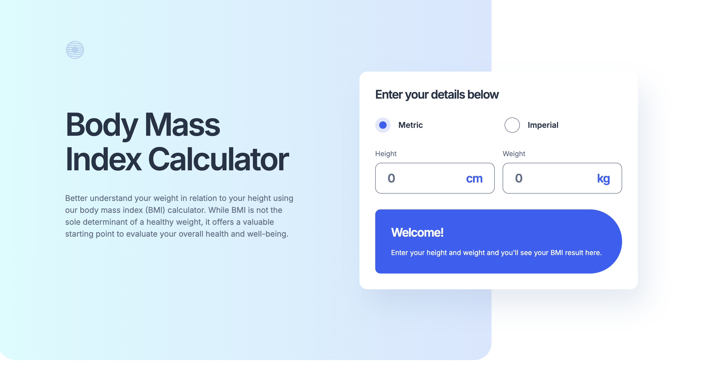
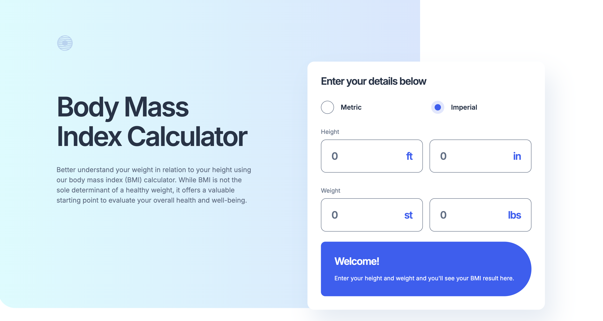
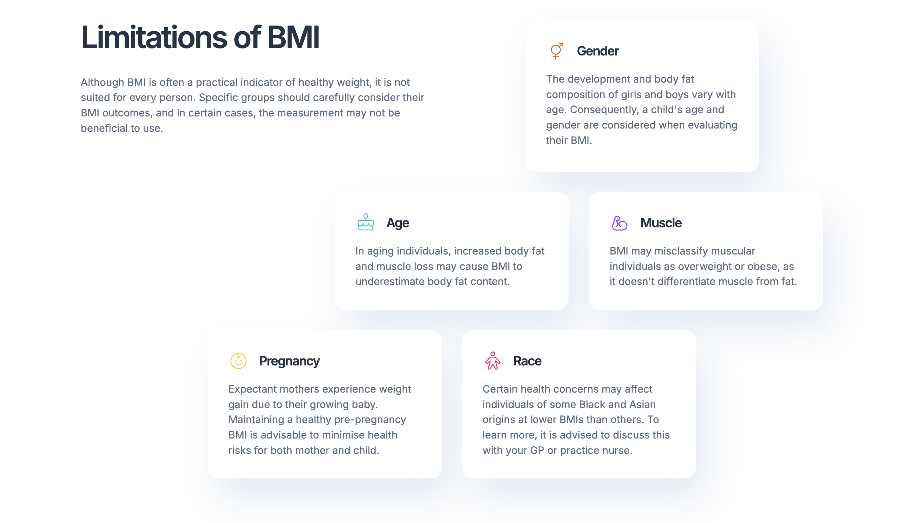

# Body Mass Index Calculator

## Table of contents

- [Overview](#overview)
  - [Screenshot](#screenshot)
  - [Links](#links)
- [My process](#my-process)
  - [Built with](#built-with)
- [Author](#author)

## Overview

### Screenshot

### Links

- Solution URL: [Solution URL](https://github.com/kisu-seo/body_mass_index_calculator)
- Live Site URL: [Live URL](https://kisu-seo.github.io/body_mass_index_calculator/)

## My process

### Built with

- **Vanilla JavaScript** — Pure DOM manipulation without any frameworks. Features include real-time BMI calculation on `input` events, Metric/Imperial unit toggling, welcome/result state switching via `hidden` class, and separate pure calculation functions (`computeMetricBMI`, `computeImperialBMI`) decoupled from DOM logic.
- **Tailwind CSS (Play CDN)** — Styling implemented entirely through utility classes. Design system tokens (colors, typography presets, spacing scale) are defined in an external `tailwind.config.js` file and loaded via the Play CDN.
- **Tailwind Interactive Utilities** — Leverages `peer`, `peer-checked:`, `group`, `group-hover:`, and `focus-within:` variants to create custom radio button UI and interactive input field states strictly through utility classes, with zero custom CSS.
- **Semantic HTML5 Markup** — Structured with `<main>`, `<section>`, `<article>`, `<form>`, and `<fieldset>` / `<legend>` for a meaningful and logical document outline.
- **Mobile-First Responsive Layout** — Uses Flexbox and CSS Grid with Tailwind breakpoints (`md:`, `lg:`) to adapt from a single-column vertical stack on mobile to an asymmetric two-column layout on desktop (`lg:`).
- **Web Accessibility (A11y)**
  - All form inputs are properly associated with `<label>` elements and supplemented with `aria-label` for screen reader clarity on unit suffixes.
  - Custom radio buttons built with native `<input type="radio">` hidden via `sr-only` to preserve full keyboard navigation and focus states.
  - Dynamic result state toggling communicated to screen readers via `aria-live="polite"` and `aria-atomic="true"`.
  - Decorative images marked with `aria-hidden="true"` to prevent screen reader noise.
- **Google Fonts** — Integrated `Inter` (weights 400, 600, 700) for all text to match the design specification.

## Author

- Website - [Kisu Seo](https://github.com/kisu-seo)
- Frontend Mentor - [@kisu-seo](https://www.frontendmentor.io/profile/kisu-seo)
